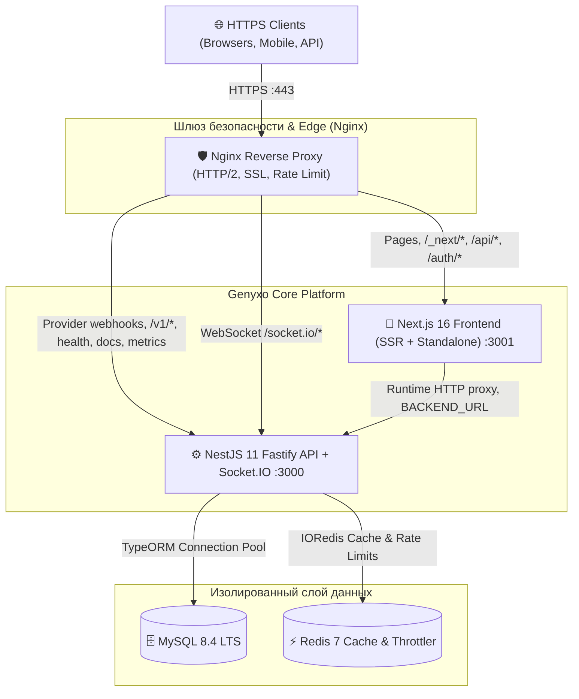

# Genyxo Platform - Infrastructure & Deployment Guide 🚀

Документация по развертыванию, оркестрации и обслуживанию высоконагруженной производственной инфраструктуры **Genyxo**.

---

## 🏗️ Архитектурный обзор



---

## ⚡ 1. Быстрый старт (Local Development)

### Требования

- Docker Engine 24+ & Docker Compose v2+
- Node.js 22 LTS (опционально для запуска вне Docker)

### Запуск стека разработки (с Hot-Reload и отладчиком)

**Windows (PowerShell):**

```powershell
.\scripts\dev.ps1 -Action up
```

**Linux / macOS (Bash):**

```bash
chmod +x ./scripts/*.sh
./scripts/dev.sh up
```

### Доступные эндпоинты в Dev-режиме:

| Сервис               | Адрес                                                                            | Описание                                                            |
| -------------------- | -------------------------------------------------------------------------------- | ------------------------------------------------------------------- |
| **Frontend UI**      | [http://localhost:3001](http://localhost:3001)                                   | Next.js 16 с быстрым обновлением (HMR)                              |
| **Backend API**      | [http://localhost:3000](http://localhost:3000)                                   | NestJS с nodemon/watch                                              |
| **Backend Debugger** | `localhost:9229`                                                                 | Node Inspector для отладки в VS Code / Chrome DevTools              |
| **Health Check**     | [http://localhost:3000/health/readiness](http://localhost:3000/health/readiness) | Проверка MySQL и Redis                                              |
| **Redis Commander**  | [http://localhost:8081](http://localhost:8081)                                   | Веб-интерфейс просмотра ключей Redis                                |
| **MySQL Database**   | `localhost:3306`                                                                 | Доступ для DataGrip / DBeaver (`user: root`, `pass: root_password`) |

---

## 🚀 2. Развертывание в Production (Docker Compose)

### Шаг 1: Конфигурация переменных окружения

```bash
cp apps/backend/.env.example apps/backend/.env
# Заполните в apps/backend/.env ваши боевые ключи (JWT_SECRET, API-ключи AI, пароли БД)
```

Для прямого вызова Compose передавайте `--env-file apps/backend/.env`,
например `docker compose --env-file apps/backend/.env up --build -d`.
Скрипты запуска уже передают этот путь. Контексты сборки находятся в
`apps/backend` и `apps/web`; backend environment file подключается из
`apps/backend/.env`.

### Шаг 2: Запуск production стека

```bash
# Windows
.\scripts\prod.ps1 -Action up

# Linux / macOS
./scripts/prod.sh up
```

### Что делает Production стек:

1. Собирает минимальные образы на базе `node:22-alpine` без лишних dev-зависимостей.
2. Запускает контейнеры под непривилегированными системными пользователями (`nestjs`, `nextjs`).
3. Включает `tini` для корректной передачи сигналов SIGTERM и отсутствия процессов-зомби.
4. Nginx слушает порты 80 и 443, автоматически генерирует самоподписанный SSL при отсутствии сертификатов в `nginx/ssl/` (или использует ваши боевые сертификаты).
5. Базы данных изолированы в закрытой сети `backend_net` и недоступны напрямую из внешней сети.

---

## 🐳 3. Оркестрация в Docker Swarm (High Availability)

Для развертывания на кластере из нескольких серверов под управлением Docker Swarm:

```bash
# Инициализация Swarm (если еще не инициализирован)
docker swarm init

# Деплой стека с автоматическим масштабированием реплик и rolling updates
docker stack deploy -c docker-compose.yml -c docker-compose.prod.yml genyxo

# Проверка статуса сервисов
docker stack services genyxo
```

---

## ☸️ 4. Развертывание в Kubernetes (K8s)

Все манифесты находятся в директории `k8s/`:

- `00-namespace.yaml` — изолированное пространство `genyxo`
- `01-configmap.yaml` — параметры конфигурации
- `02-secret.example.yaml` — шаблон защищенных секретов
- `03-backend-deployment.yaml` — бэкенд (3 реплики, RollingUpdate, Liveness/Readiness/Startup probes)
- `03-frontend-deployment.yaml` — фронтенд (2 реплики)
- `04-services.yaml` — ClusterIP сервисы
- `05-hpa.yaml` — горизонтальное автоскейлирование по CPU и RAM (от 2 до 10 подов)
- `06-pdb.yaml` — PodDisruptionBudget для гарантии нулевого простоя при обновлении нод
- `07-ingress.yaml` — Ingress с поддержкой cert-manager (Let's Encrypt TLS) и WebSocket
- `08-networkpolicy.yaml` — Zero-Trust изоляция сетевого трафика
- `database/` — StatefulSets для MySQL и Redis (если базы хостятся внутри K8s)

### Применение манифестов в кластер:

```bash
chmod +x ./scripts/k8s-deploy.sh
./scripts/k8s-deploy.sh
```

---

## 📦 5. Развертывание через Helm 3 Chart

Готовый облачный Helm-чарт расположен в `helm/genyxo/`.

```bash
# Проверка синтаксиса и рендеринга чарта
helm template genyxo ./helm/genyxo

# Установка или обновление в кластере
helm upgrade --install genyxo ./helm/genyxo \
  --namespace genyxo --create-namespace \
  --set backend.image.tag="latest" \
  --set secrets.JWT_SECRET="ваш_секретный_ключ" \
  --set secrets.MYSQLPASSWORD="ваш_пароль_к_бд"
```

---

## 🛡️ 6. Nginx & Безопасность

Конфигурация Nginx в `nginx/`:

- **SSL / TLS**: Поддержка TLS 1.2 и TLS 1.3 с современными шифрами Mozilla Modern.
- **WebSocket**: Директива `map $http_upgrade $connection_upgrade` и проксирование заголовков для бесперебойной работы сокетов уведомлений и чата.
- **Rate Limiting**:
  - Общий лимит API: `30 r/s` с буфером всплесков `burst=50 nodelay`.
  - Защита авторизации: `5 r/s` с буфером `burst=10 nodelay`.
- **Кэширование**: Статика Next.js `/_next/static/` кэшируется браузерами с `Cache-Control: public, max-age=31536000, immutable`.
- **Заголовки безопасности**: `X-Frame-Options`, `X-Content-Type-Options`, `X-XSS-Protection`, `Referrer-Policy`, `Strict-Transport-Security`.

---

## 💾 7. Резервное копирование базы данных

В комплект входит скрипт горячего резервного копирования MySQL с gzip-компрессией и ротацией:

```bash
# Запуск создания бэкапа
./scripts/db-backup.sh

# Восстановление из бэкапа
zcat /var/backups/genyxo/genyxo_backup_YYYYMMDD_HHMMSS.sql.gz | docker exec -i genyxo-mysql mysql -uroot -p$MYSQL_ROOT_PASSWORD genyxo
```

---

## 🔄 8. CI/CD Pipeline (GitHub Actions)

Workflow-файл `.github/workflows/ci-cd.yml` автоматически выполняет:

1. **Quality Gate**: Тестирование TypeScript, Jest тесты бэкенда, проверка сборки Next.js.
2. **Build & Push**: Сборка образов Backend, Frontend и Nginx с кэшированием слоев в GitHub Container Registry (`ghcr.io`).
3. **Security Scan**: Анализ образов сканером уязвимостей Trivy.
4. **Deploy**: Автоматический роллаут в Kubernetes кластер через Helm.
